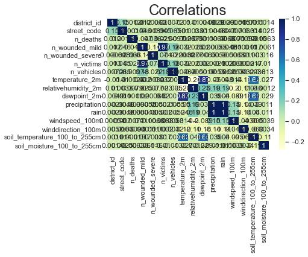
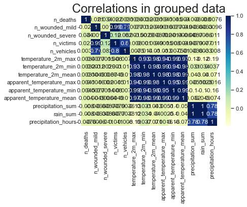
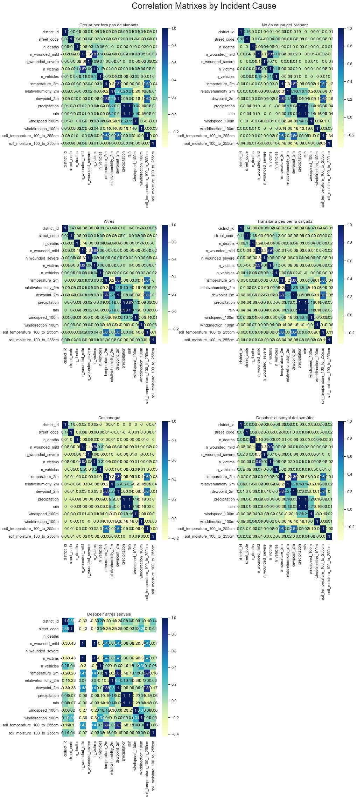
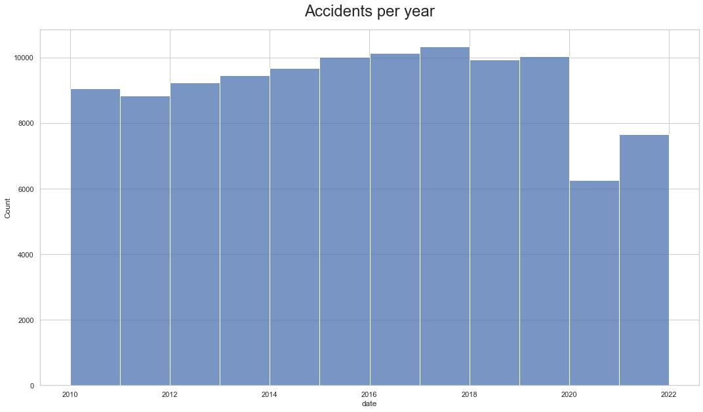
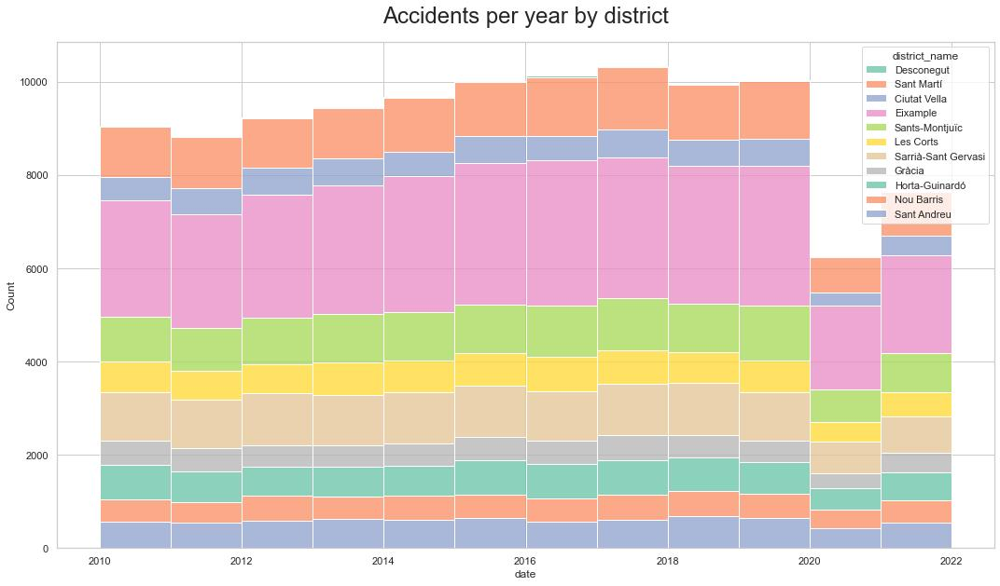
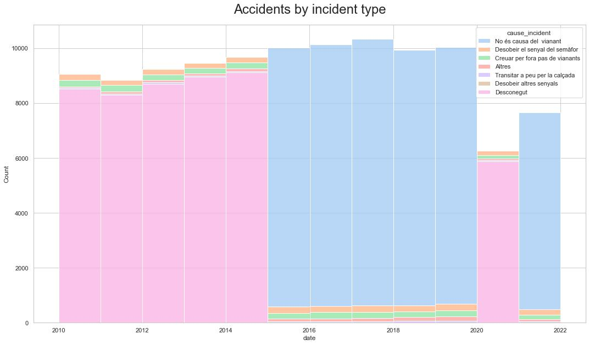
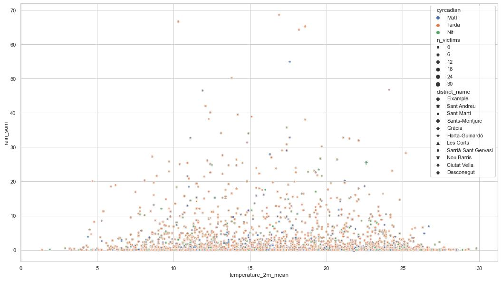
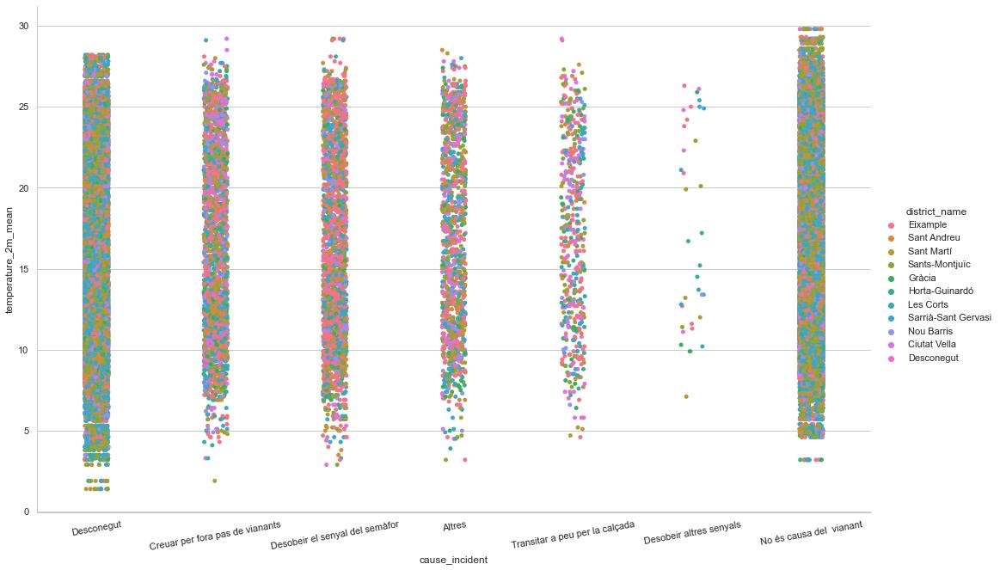

# Project II: Pipelines
## Week 3 Project
### Andrés Castro

For this project I used public data from traffic accidents in Barcelona and added weather information for the exact time of the reported time using a free public API. Then I analyzed it to see if the weather conditions could have an impact on the occurance of accidents.

The data source was fairly clean so data cleaning was minimal (deleted a few columns and hardly dropped any rows for lack of values). 

The main hypothesis I tried to prove was:

## Weather variables (temperature, rain, humidity) have an effect on the occurance of traffic accidents

The accidents data was obtained through the Kaggle API. It consisted of a .csv file with 110.682 unique observations of traffic accidents. These observations spanned from 01/01/2010 to 31/12/2021. This dataset included 4 columns with information on the year, month, day and hour of ocurrance. These columns were mereged into a single DateTime pandas column.

From the [Open Meteo](https://open-meteo.com) free open source weather API I obtained weather information to enrich the accidents dataframe. In a single call I obtained weather information on 9 variables for every hour of every day from 01/01/2010 to 31/12/2021 (~ 105K data points).

With these two data sets I added weather information for the exact reported hour to every accident in the original data set and analyzed correlations:

Seeing these low correlations I thought that maybe grouping by date could increase these relationships. Sadly, the correlations were not greatly affected:

Finally I split my dataset by the incident type and analyzed correlaitons for every type:

Even though our hypothesis is turning out to be wrong we still proceded with graphing.
## Graphic analysis

Lets start exploring the data set through graphs, we'll start by plotting a histogram of accidents over time:

Accidents seem pretty evenly distributed over time. We can see a tip in the first part of 2020. Surely it must be related to the COVID-19 pandemic. Lets dive deeper into the data we have.

### Accidents by district

Looks like l'Eixample is the area with most incidents. Lets have a look at the incident type now.

### Accidents by incident type

This plot is suggesting there has been some sort of methodology change. Most fo the cases are being classified as "Desconegut" or "No és causa del vianant" for distinct periods of time (2010 - 2015, and 2020) and (2015 - 2019 and 2021) respectively.

Lets now explore how different variables behave across our data.

### Accidents (vs Rain & temperature)
The following scatter plot shows every accident registered according to the total rainfall during that day and the mean temperature.

Rain does not seem to particularly affect the ocurrance of accidents. If anything, most of the accidents occur when theres litle to no rain. The same can be said about temperature, accidents seem to occur with the same frequency on low temperatures and on higher ones. Lets take a deeper look into incident causes:

### Accidents by cause:

# Conclusion

The only relatively signifcant covariance value we obtained was the relationship between the amount of cases where people disobeyed other traffic signals (Desobeir altres senyals) and temperature. However, looking at the categorical plot, the number of cases in this category is significantly lower than other categories and that must be affecting this correlation value (the little values we have seem to be relatively evenly distributed).

## Possible analysis flaws

1. Data collecting procedures and parameters need to be revised
    I could not find any specific information on how this data was collected other than it was collected by "la guardia urabana". We are looking at only reported cases and of those instances, the category of accidents is limited and seems to be centered on accidents involving pedestrians.

    Original data set: https://opendata-ajuntament.barcelona.cat/data/ca/dataset/accidents-gu-bcn

2. The occurrance of rain was the main suspect in this analysis
    The initial assumption was that the ocurrance of rain would increase the number of accidents. However, adding current weather conditions didnt show any significant correlaltion between this factor and the number of accidents. I also tried offsetting the weather conditions by 1, 2 and even 3 hours, under the asumption that rain only starts causing accidents after it has stopped and the streets are wet. However these analysis yield similar results: low correlation.

## Takeaways

### Don't worry too much about the rain

